# React + Vite

# Grupo 5 - TP2 React

[](https://reactjs.org/)
[](https://vitejs.dev/)
[](https://developer.mozilla.org/en-US/docs/Web/CSS)
[]()

## 🌐 Links del Proyecto

- **🚀 Deploy en Vercel:** [tp-2-desarrollo-web-2026.vercel.app](tp-2-desarrollo-web-2026.vercel.app)
- **📂 Repositorio GitHub:** [[https://github.com/marianabborda/TP2-Desarrollo-Web-2026.git](https://github.com/marianabborda/TP2-Desarrollo-Web-2026.git)]

---

## 👥 Equipo - Grupo 5

### Integrantes

- Tomás Amsler - Link a GitHub: [https://github.com/TomasAmsler]
- Rodrigo Berger - Link a GitHub: [https://github.com/rdbergeruser-stack]
- Mariana Borda - Link a GitHub: [https://github.com/marianabborda]
- Gimena Escalante - Link a GitHub: [https://github.com/GimEscalante]
- Alejandra Vazquez - Link a GitHub: [https://github.com/AleVaz70]

---

## 📋 Descripción

Nuestro proyecto es una **Single Page Application (SPA)** desarrollada en React que presenta a nuestro equipo de desarrollo. Este proyecto representa la **migración completa del TP1** (sitio web estático HTML/CSS/JS) a una arquitectura moderna de React, implementando componentes reutilizables, routing dinámico y consumo de APIs.

### 🎯 Objetivo Principal

Transformar el sitio web estático del TP1 en una SPA moderna utilizando React, mejorando la modularidad, escalabilidad y experiencia de usuario mediante:

- Componentización efectiva
- Gestión de estado con hooks
- Integración de datos dinámicos (JSON local + API pública)
- Diseño responsive avanzado

---

## 🚀 Características Principales

### ✨ Funcionalidades Implementadas

| Característica               | Descripción                                                                      |
| ---------------------------- | -------------------------------------------------------------------------------- |
| **🛣️ SPA con React Router**  | Navegación fluida sin recarga de páginas entre secciones                         |
| **📱 Sidebar Responsive**    | Menú lateral fijo con modo hamburguesa en móviles                                |
| **🎨 Portales Individuales** | Portales de cada integrante del equipo                                           |
| **🌐 JSON y API Integrada**  | Películas y Libros desde JSON local y Música desde API pública iTunes Search API |
| **📐 Diseño Responsive**     | Optimizado para desktop, tablet y móvil                                          |
| **🎯 Componentización**      | Arquitectura modular con componentes reutilizables                               |
| **📊 Diagramas Técnicos**    | Visualización de la arquitectura del proyecto                                    |

---

## 🛠️ Stack Tecnológico

- **⚛️ React 19** - Librería principal con hooks modernos.
- **🚀 Vite** - Build tool rápido y dev server optimizado.
- **🎨 CSS3 Puro** - Estilos modernos sin frameworks (CSS Variables, Flexbox, Grid).
- **✒️ Google Fonts** - Utilizamos Playfair Display y DM Sans para la tipografía del proyecto.
- **Visual Studio Code** – Entorno de desarrollo.
- **GitHub** – Control de versiones y repositorio remoto.
- **Vercel** – Despliegue en la nube.

---

## Guía de estilos

#### 🎨 Paleta de Colores

**Fondos**

- `#0d0d1a` → Fondo principal, fondo Sidebar
- `#111827` → Fondo secundario
- `rgba(255, 255, 255, 0.03) / rgba(255, 255, 255, 0.05)` → Fondo de secciones

**Textos**

- `#ffffff / #e5e7eb` → Texto principal
- `#ffffff/#e0aaff/#c77dff` → Títulos
- `#9d4edd` → Texto secundario
- `#ffffff / #cccccc / #aaaaaa` → Texto descriptivo / suave

**Acentos**

- `#c77dff` → Para estados hover, textos destacados y enlaces
- `#7b2cbf` → Acento oscuro
- `#00d4ff` → Color asignado para los nombres de las secciones del Sidebar y títulos portales chicos
- `rgba(0, 212, 255, 0.6)`
- `linear-gradient(135deg, #c77dff 0%, #9d4edd 50%, #7b2cbf 100%)` → Degradado

**Bordes y detalles**

- `#e0aaff / rgba(224, 170, 255, 0.15)` → Bordes de bloques
- `#9d4edd` → Bordes del proyecto
- `rgba(199, 125, 255, 0.45)` → Bordes en hover

**Sombras**

- `box-shadow: 0 10px 30px rgba(0, 0, 0, 0.4)` → Sombras de profundidad
- `rgba(224, 170, 255, 0.6)` → Efecto glow violeta

### 🔤 Tipografías

**Títulos:** **Fuente:** Playfair Display - **Estilo:** Serif, elegante, utilizada en mayúsculas

**Contenido principal, párrafos y textos descriptivos:** **Fuente:** DM Sans - **Estilo:** Sans-serif, moderna, limpia y de alta legibilidad

---

## 📁 Estructura del Proyecto

```
tp2-grupo5-comd/
├── 📁 public/
│   └── 📁 img/                # Imágenes, avatares, logos, diagramas
│
├── 📁 src/
│   ├── 📁 components/         # Componentes reutilizables
│   │   ├── 📁 cards/
│   │   │   ├── LibroCard.jsx
│   │   │   ├── MusicaCard.jsx
│   │   │   └── PeliculaCard.jsx
│   │   ├── 📁 ui/
│   │   │   ├── CardGrid.jsx
│   │   │   ├── HeroSection.jsx
│   │   │   └── ui.css
│   │   ├── PortalBase.jsx     # Componente base para portales
│   │   ├── Sidebar.css
│   │   ├── Sidebar.jsx
│   │   ├── TimelineItem.css
│   │   ├── TimelineItem.jsx
│   │
│   │
│   ├── 📁 data/
│   │   │── libros.json
│   │   └── peliculas.json
│   │
│   ├── 📁 pages/              # Páginas principales
│   │   ├── 📁 portales/
│   │   │   ├── Alejandra.jsx
│   │   │   ├── Gimena.jsx
│   │   │   ├── Mariana.jsx
│   │   │   ├── Rodrigo.jsx
│   │   │   └── Tomas.jsx
│   │   │
│   │   ├── Bitacora.css
│   │   ├── Bitacora.jsx
│   │   ├── Diagramas.css
│   │   ├── Diagramas.jsx
│   │   ├── Home.css
│   │   ├── Home.jsx
│   │   ├── Integrantes.css
│   │   ├── Integrantes.jsx
│   │   ├── LibrosGaleria.jsx
│   │   ├── Musica.jsx
│   │   └── Peliculas.jsx
│   │
│   ├── 📁 styles/             # Estilos globales y temas
│   │   ├── IntegrantesBase.css
│   │   ├── MediaPages.css
│   │   ├── themes.css
│   │   ├── util.css
│   │   └── variables.css
│   │
│   ├── App.css                # Componente raíz + routing
│   ├── App.jsx
│   ├── index.css
│   └── main.jsx               # Punto de entrada
│
├── .gitignore
├── index.html
├── package.json
├── README.md
└── vite.config.js
```

---

## JavaScript/React – Funciones Dinámicas Implementadas y Componentes Clave

## Introducción

El proyecto fue desarrollado utilizando **React JS** y estructurado como una **SPA (Single Page Application)** mediante el uso de componentes reutilizables, navegación dinámica y manejo de estados con Hooks de React.

La aplicación incorpora distintas funcionalidades dinámicas como filtrado en tiempo real, consumo de API externa, paginación, lightbox interactivo, navegación responsive y renderizado dinámico de componentes.

## Funciones Dinámicas Implementadas

### 1. Filtrado dinámico de películas en tiempo real

### Archivo principal

`src/pages/Peliculas.jsx`

### Funcionalidad implementada

La sección de películas incorpora un sistema de búsqueda dinámica y filtrado por género utilizando los Hooks `useState`, `useEffect` y `useRef`.

### Características principales

- Búsqueda instantánea por título o director.
- Filtrado por categorías/géneros.
- Actualización automática del contenido renderizado.
- Re-render optimizado de la grilla.
- Uso de `ResizeObserver` para recalcular el layout dinámicamente.

### Tecnologías utilizadas

- React Hooks (`useState`, `useEffect`, `useRef`)
- Renderizado condicional
- Manipulación dinámica del DOM

### Fragmento lógico destacado

```jsx
const peliculasFiltradas = peliculasBase.filter((peli) => {
  const termino = busqueda.toLowerCase();

  const coincideTexto =
    peli.titulo?.toLowerCase().includes(termino) ||
    peli.director?.toLowerCase().includes(termino);

  const coincideGenero =
    generoSeleccionado === "Todos" || peli.genero === generoSeleccionado;

  return coincideTexto && coincideGenero;
});
```

### Captura de pantalla - Filtrado de Películas

<p style="text-align: center;">
  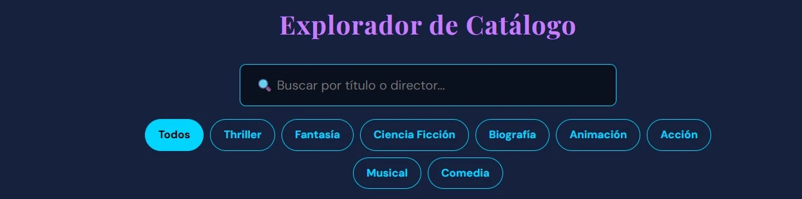
</p>

---

### 2. Consumo de API externa con paginación

### Archivo principal

`src/pages/Musica.jsx`

### Funcionalidad implementada

La sección de música consume datos dinámicamente desde la API pública de iTunes mediante `fetch` y renderiza canciones en tiempo real.

### Características principales

- Consumo de API REST.
- Manejo de carga (`loading`) y errores.
- Paginación dinámica.
- Renderizado automático de resultados.
- Uso de asincronía con `async/await`.

### Tecnologías utilizadas

- Fetch API
- React Hooks
- Manejo de estados
- Paginación lógica

### Fragmento lógico destacado

```jsx
const respuesta = await fetch(
  "https://itunes.apple.com/search?term=rock+argentino&entity=song&limit=40"
);
```

### Paginación implementada

```jsx
const indiceUltimoItem = paginaActual * cancionesPorPagina;
const indicePrimerItem = indiceUltimoItem - cancionesPorPagina;

const cancionesPaginaActual = canciones.slice(
  indicePrimerItem,
  indiceUltimoItem
);
```

### Captura de pantalla - Biblioteca Musical

<p style="text-align: center;">
  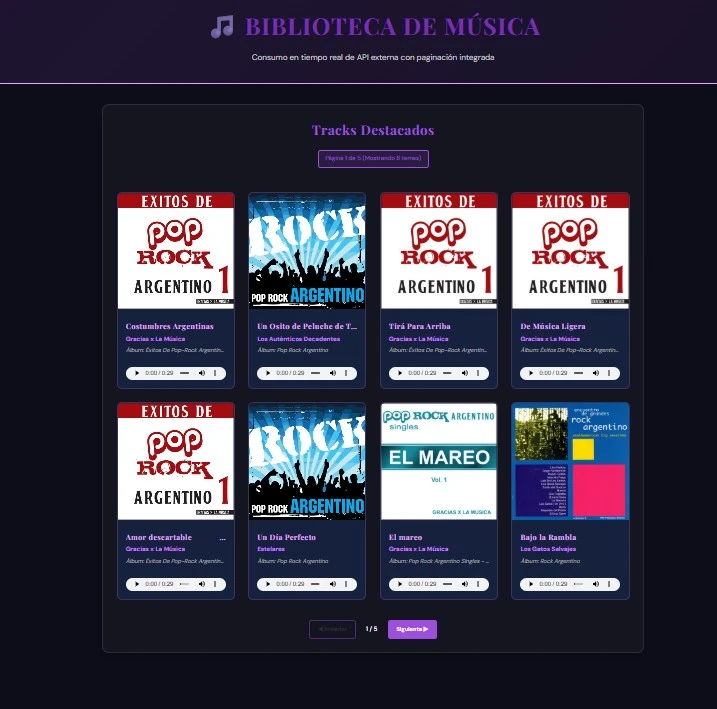
</p>

---

### 3. Lightbox interactivo para galería de libros

### Archivo principal

`src/pages/LibrosGaleria.jsx`

### Funcionalidad implementada

La galería de libros implementa un visualizador interactivo tipo Lightbox con navegación interna y control mediante teclado.

### Características principales

- Apertura dinámica de imágenes.
- Navegación entre libros.
- Control mediante teclado.
- Zoom interactivo.
- Bloqueo de scroll del fondo.
- Cierre mediante tecla ESC.

### Tecnologías utilizadas

- React Hooks
- Eventos globales (`keydown`)
- Renderizado condicional
- Manejo dinámico de estilos

### Fragmento lógico destacado

```jsx
useEffect(() => {
  const handleKeyDown = (e) => {
    if (e.key === "Escape") {
      cerrarLightbox();
    }
  };

  window.addEventListener("keydown", handleKeyDown);

  return () => window.removeEventListener("keydown", handleKeyDown);
}, [indexSelect]);
```

### Captura de pantalla - Lightbox Libros

<p style="text-align: center;">
  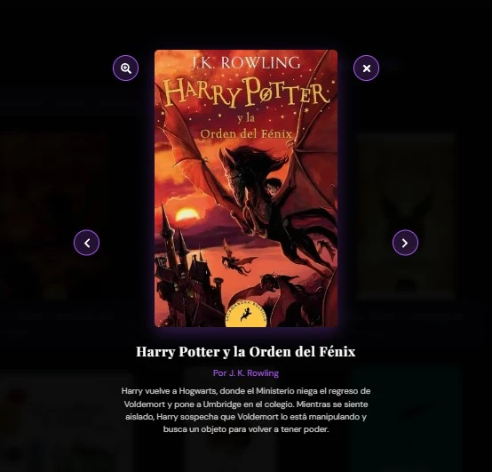
</p>

---

### 4. Sidebar responsive con menú hamburguesa

### Archivo principal

`src/components/Sidebar.jsx`

### Funcionalidad implementada

El proyecto incorpora una barra lateral responsive adaptable a dispositivos móviles mediante un menú hamburguesa interactivo.

### Características principales

- Apertura/cierre dinámico.
- Overlay accesible.
- Navegación SPA mediante `React Router`.
- Adaptación responsive.
- Cierre automático en dispositivos móviles.

### Tecnologías utilizadas

- React Router DOM
- Renderizado condicional
- Eventos dinámicos
- CSS responsive

### Fragmento lógico destacado

```jsx
const handleLinkClick = () => {
  if (window.innerWidth <= 768) toggleSidebar();
};
```

### Captura de pantalla - Sidebar

<p style="text-align: center;">
  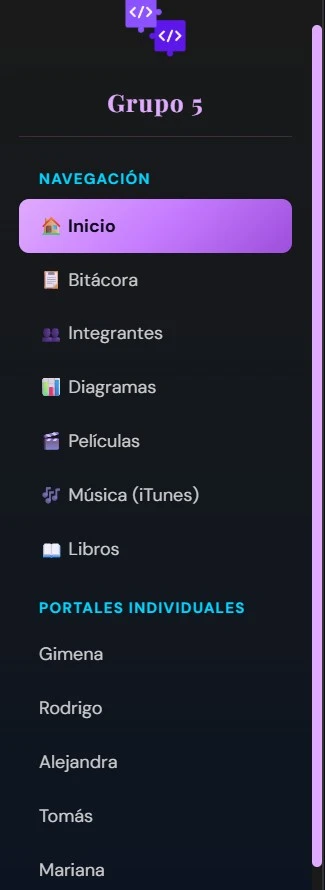
</p>

### Captura de pantalla - Sidebar Responsive

<p style="text-align: center;">
  
</p>

---

## Componentes Clave del Proyecto

### 1. HeroSection

### Archivo

`src/components/ui/HeroSection.jsx`

### Descripción

Componente reutilizable utilizado como encabezado visual de las distintas páginas del proyecto.

### Funcionalidades

- Título dinámico.
- Subtítulo configurable.
- Colores personalizables.
- Gradientes dinámicos.

### Props utilizadas

```jsx
<HeroSection
  title="🎵 Biblioteca de Música"
  subtitle="Consumo en tiempo real de API externa"
  accentColor="#9d4edd"
/>
```

### Captura de pantalla - Hero Musica

<p style="text-align: center;">
  
</p>

---

### 2. CardGrid

### Archivo

`src/components/ui/CardGrid.jsx`

### Descripción

Componente reutilizable encargado de renderizar tarjetas dinámicamente mediante `map()`.

### Funcionalidades

- Renderizado dinámico.
- Navegación mediante enlaces.
- Reutilización para distintas secciones.
- Diseño modular.

### Fragmento lógico

```jsx
{items.map((item, i) => (
  <Link key={i} to={item.link} className={`card-item ${type}`}>
```

### Captura de pantalla - CardGrid

<p style="text-align: center;">
  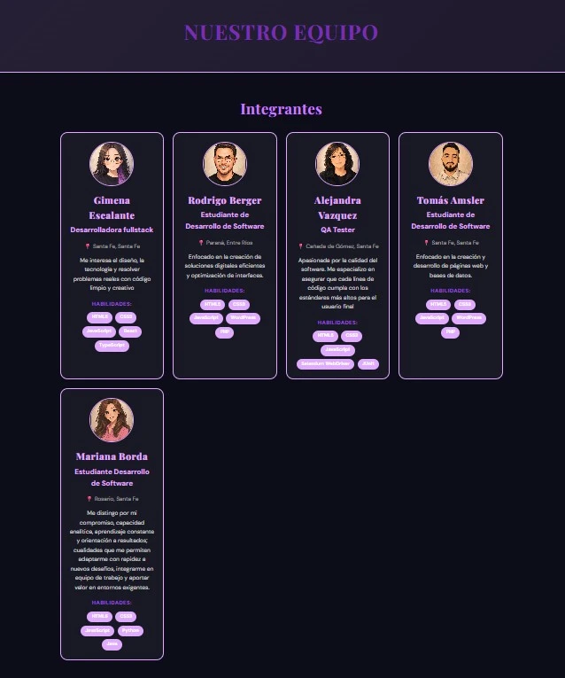
</p>

---

### 3. PortalBase

### Archivo

`src/components/PortalBase.jsx`

### Descripción

Componente base reutilizado por los portales individuales de cada integrante.

### Funcionalidades

- Carrusel dinámico de proyectos.
- Menú responsive.
- Redes sociales.
- Navegación interna.
- Renderizado dinámico de información.

### Tecnologías utilizadas

- useState
- Componentización reutilizable
- Renderizado dinámico

### Fragmento lógico

```jsx
const [currentProject, setCurrentProject] = useState(0);
const [isMenuOpen, setIsMenuOpen] = useState(false);
```

### Captura de pantalla - PortalBase

<p style="text-align: center;">
  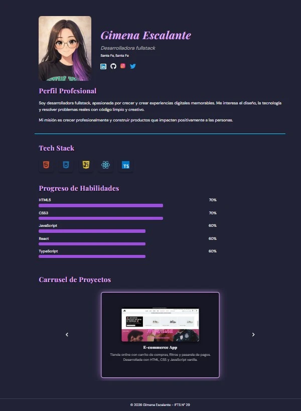
</p>

---

## 4. PeliculaCard, LibroCard y MusicaCard

### Ubicación

`src/components/cards/`

### Descripción

Conjunto de componentes reutilizables encargados de mostrar información multimedia de manera dinámica.

### Funcionalidades

- Renderizado mediante props.
- Tarjetas visuales reutilizables.
- Diseño responsive.
- Integración con datos JSON y API.

### Captura de pantalla - Cards Multimedia

<p style="text-align: center;">
  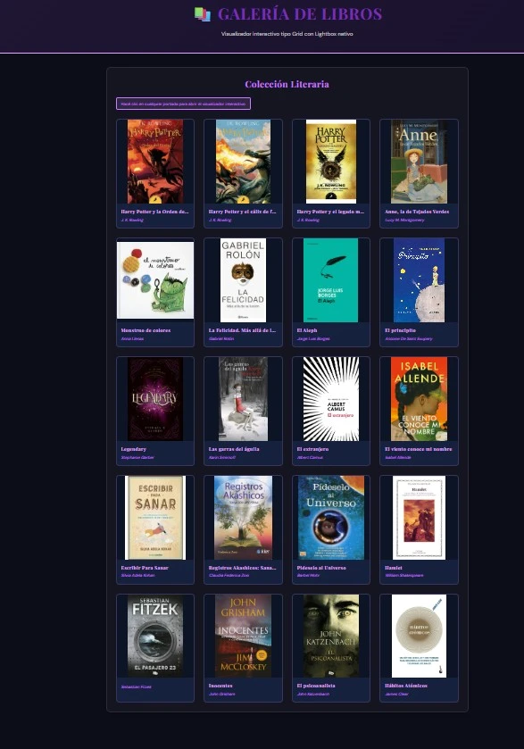
</p>

---

## 🎯 Mejoras TP1 → TP2

<details>
<summary> <h3>Evolución del Proyecto </h3></summary>

## Versión Inicial – HTML, CSS y JavaScript

La primera versión del proyecto fue desarrollada utilizando tecnologías frontend tradicionales:

- HTML5 para la estructura.
- CSS3 para estilos visuales y diseño responsive.
- JavaScript Vanilla para la interacción dinámica.

### Características de la versión inicial

- Sitio web estático multipágina.
- Navegación tradicional.
- Manipulación manual del DOM.
- Código menos modular.
- Reutilización limitada de componentes.
- Organización básica de archivos.

### Tecnologías utilizadas inicialmente

```txt
HTML5 + CSS3 + JavaScript
```

### Capturas de la versión inicial - Home Inicial

<p style="text-align: center;">
  
</p>

---

## Migración y Evolución hacia React JS

Posteriormente, el proyecto fue completamente refactorizado y migrado a React JS con el objetivo de mejorar:

- La escalabilidad.
- La reutilización del código.
- La organización del proyecto.
- El rendimiento de renderizado.
- La experiencia de usuario.
- El mantenimiento del sistema.

La migración permitió transformar el proyecto en una **SPA (Single Page Application)** moderna basada en componentes reutilizables.

### Capturas de la versión actual - Home Actual

<p style="text-align: center;">
  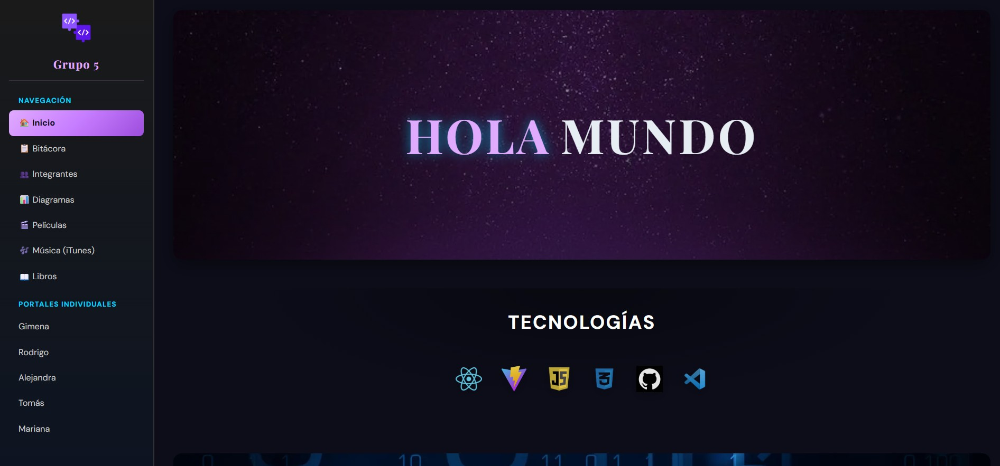
</p>

---

## Mejoras Implementadas Durante la Evolución

## 1. Componentización del Proyecto

### Antes

La lógica y la interfaz estaban mezcladas en archivos HTML y JavaScript.

### Ahora

El proyecto fue dividido en componentes reutilizables:

- `HeroSection`
- `CardGrid`
- `Sidebar`
- `PortalBase`
- `TimelineItem`
- `PeliculaCard`
- `LibroCard`
- `MusicaCard`

### Beneficios obtenidos

- Mayor reutilización.
- Código más limpio.
- Mejor mantenimiento.
- Escalabilidad.

### Captura - Componentización React

<p style="text-align: center;">
  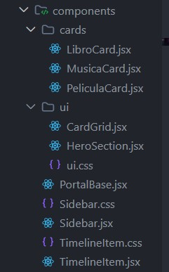
</p>

---

## 2. Implementación de React Router

La navegación fue migrada desde múltiples páginas HTML tradicionales hacia una arquitectura SPA utilizando React Router DOM.

El archivo `main.jsx` configura `BrowserRouter`, mientras que `App.jsx` centraliza la definición de rutas dinámicas mediante `<Routes>` y `<Route>`.

### Mejoras obtenidas

- Navegación más rápida.
- Mejor experiencia de usuario.
- Arquitectura moderna.
- Manejo dinámico de rutas.

### Captura - React Router

<p style="text-align: center;">
  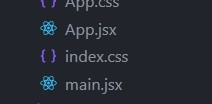
</p>

---

## 3. Uso de Hooks y Estados Dinámicos

### Antes

La interacción se realizaba manipulando el DOM manualmente.

### Ahora

Se utilizan Hooks modernos de React:

```jsx
useState();
useEffect();
useRef();
```

### Mejoras obtenidas

- Manejo eficiente del estado.
- Re-renderizado optimizado.
- Código más declarativo.
- Mejor organización lógica.

### Captura - Hooks React

<p style="text-align: center;">
  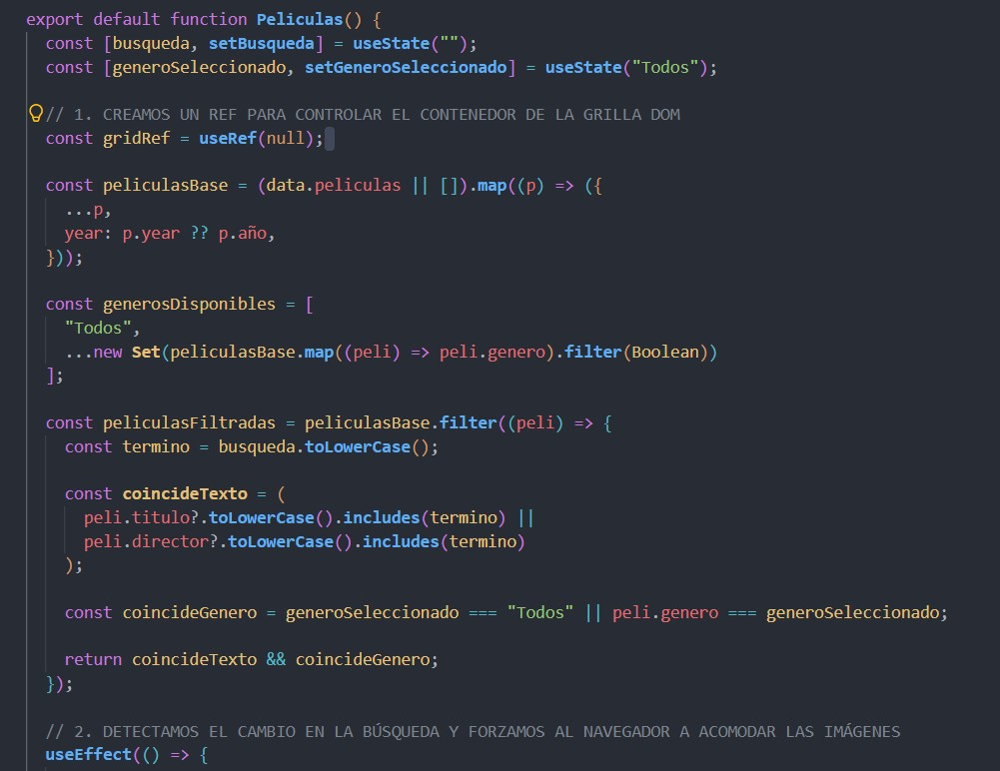
</p>

---

## 4. Consumo de APIs Externas

### Antes

El contenido multimedia era estático.

### Ahora

La sección musical consume información dinámica desde una API externa.

### Mejoras obtenidas

- Datos en tiempo real.
- Mayor dinamismo.
- Experiencia interactiva.
- Contenido actualizado automáticamente.

### Captura - API React

<p style="text-align: center;">
  
</p>

---

## 5. Mejora del Diseño Responsive

### Antes

El diseño responsive era limitado.

### Ahora

Se implementó una interfaz moderna adaptable a distintos dispositivos:

- Sidebar responsive.
- Menú hamburguesa.
- Layout flexible.
- Grillas dinámicas.
- Mejor distribución visual.

### Captura - Home Desktop

<p style="text-align: center;">
  
</p>

### Captura - Home Movile

<p style="text-align: center;">
  
</p>

---

## 6. Optimización de la Estructura del Proyecto

### Antes

Los archivos estaban organizados de forma monolítica.

### Ahora

El proyecto fue reorganizado siguiendo buenas prácticas:

```txt
src/
 ├── components/
 ├── data/
 ├── pages/
 ├── styles/

```

### Beneficios obtenidos

- Mejor mantenibilidad.
- Organización profesional.
- Escalabilidad.
- Separación de responsabilidades.

### Captura - Estructura React

<p style="text-align: center;">
  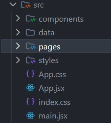
</p>

---

### Comparación General de la Evolución

| Característica    | Versión Inicial   | Versión Actual React |
| ----------------- | ----------------- | -------------------- |
| Arquitectura      | HTML tradicional  | SPA con React        |
| Navegación        | Multipágina       | React Router         |
| Reutilización     | Baja              | Alta                 |
| Componentes       | No reutilizables  | Reutilizables        |
| Estados dinámicos | JavaScript manual | Hooks de React       |
| APIs externas     | No                | Sí                   |
| Responsive        | Básico            | Avanzado             |
| Escalabilidad     | Limitada          | Alta                 |
| Organización      | Monolítica        | Modular              |

---

## Conclusión

La evolución del proyecto permitió transformar una aplicación desarrollada con HTML, CSS y JavaScript tradicional en una aplicación moderna basada en React JS.

La migración mejoró significativamente la organización del código, la reutilización de componentes, la experiencia de usuario y la escalabilidad del sistema, incorporando además funcionalidades dinámicas modernas como consumo de APIs, renderizado reactivo y navegación SPA.

</details>

---

<details>
<summary> <h3>Requerimiento Obligatorio: Uso de Inteligencia Artificial </h3></summary>
 
## Herramientas de IA Utilizadas

Durante el desarrollo y evolución del proyecto se utilizaron distintas herramientas de Inteligencia Artificial para la mejora de la redacción de la documentación, la optimización del código y resolución de problemas técnicos.

### Modelos y herramientas utilizadas

| Herramienta          | Uso principal                                                                                                                                                   |
| -------------------- | --------------------------------------------------------------------------------------------------------------------------------------------------------------- |
| ChatGPT GPT-5.5      | Asistencia en programación, mejora de documentación, debugging, generación de avatares, representación gráfica de árbol de renderizado y estructura de archivos |
| Gemini 3.5 Flash     | Apoyo en consultas técnicas                                                                                                                                     |
| Nano Banana (Gemini) | Generación de avatares                                                                                                                                          |

---

## Uso de IA en Contenido y Código

### 1. Generación de contenido textual

La IA fue utilizada para mejorar distintos textos del proyecto, incluyendo:

- README del proyecto.
- Explicaciones de componentes React.
- Descripciones funcionales.

### Ejemplos de uso

- Explicación de funcionalidades dinámicas.
- Generación de estructura profesional para README.
- Mejora de redacción y organización del contenido.

---

### 2. Asistencia en programación y debugging

Las herramientas de IA ayudaron durante el desarrollo frontend y migración del proyecto hacia React JS.

### Problemas en los que ayudó la IA

- Migración de HTML/CSS/JS hacia React.
- Organización de componentes reutilizables.
- Implementación de React Router DOM.
- Uso correcto de Hooks (`useState`, `useEffect`, `useRef`).
- Corrección de errores de renderizado.
- Resolución de problemas responsive.

## Uso de IA para Imágenes y Diseño

### Avatares

Las herramientas de IA también fueron utilizadas para generar ideas gráficas los avatares de nuestros portales.

### Modelo utilizado

- ChatGPT GPT-5.5
- Nano Banana (Gemini)

### Prompt utilizado

Nos pusimos de acuerdo en utilizar una imagen real con el siguiente prompt:

```txt
 "Recrea esta imagen con estilo anime o caricatura"
```

---

## Conclusión

El uso de herramientas de Inteligencia Artificial permitió agilizar el desarrollo del proyecto, mejorar la calidad del código y optimizar la documentación técnica.

La IA fue utilizada como herramienta de apoyo en programación y generación de contenido, contribuyendo a una mejor organización del proyecto y a una experiencia de desarrollo más eficiente.

</details>

---

## 🚦 Instalación y Uso

### Prerrequisitos

Antes de ejecutar el proyecto es necesario tener instalado:

- **Node.js** 19+
- **npm (incluido con Node.js)**
- **Visual Studio Code (recomendado)**

### Pasos de Instalación

1. **Clonar el repositorio**

```bash
git clone [URL_DEL_REPOSITORIO]
```

2. **Acceder a la carpeta del proyecto**

```bash
cd tp2-grupo5-comd
```

3. **Instalar dependencias**
   El proyecto utiliza React JS, Vite y la librería externa React Icons.

```bash
npm install
```

#### Instalación de React Icons

```bash
npm install react-icons
```

3. **Ejecutar en desarrollo**

```bash
npm run dev
```

4. **Abrir en el navegador**

```
http://localhost:5173
```

---

**Este proyecto fue desarrollado como parte del Trabajo Práctico 2 de la materia Desarrollo de Sistemas Web (Front End) - 2026.**
